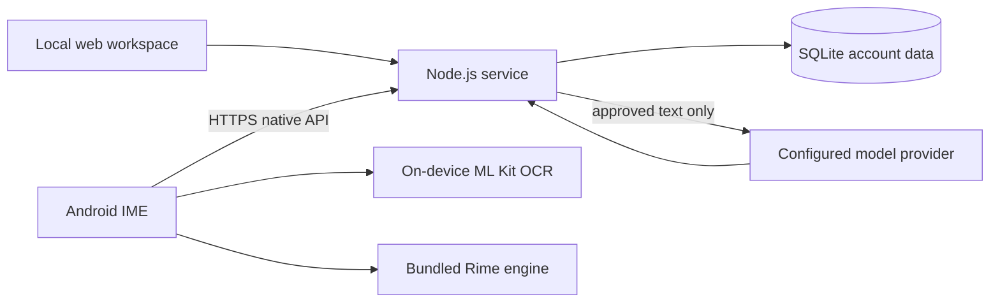

# Conversation Lens / 观微

Conversation Lens is a privacy conscious relationship workspace and Android input method. A user selects a person, provides a chat fragment, reviews the submitted context, edits the generated suggestion, and explicitly inserts it into the current text field. The software never sends a message by itself.

观微是一个注重隐私边界的关系资料与聊天建议工具。用户主动选择人物、提供聊天片段、批准联网分析、编辑建议，再由本人确认插入当前输入框；软件不会自动发送消息。

## Project status

Version `0.18.0` is a research preview. The source includes the Node.js service, local web workspace, Android IME, local Chinese OCR review flow, Rime based Chinese input, synthetic fixtures, and validation tools.

The following work still needs independent evidence before a production release:

- Android testing on physical devices and multiple OEM systems;
- Wi-Fi and mobile-data end-to-end acceptance against an operator-owned deployment;
- 20–50 authorized, deidentified samples with two independent human reviewers;
- an initial 3-person, 7-day pilot and a second cohort after fixes;
- disaster recovery and deployment migration drills. See [remaining acceptance gates](https://github.com/jianchao0653-a11y/live-chat-training/blob/main/release/ACCEPTANCE.md).

This source snapshot is built from an explicit allowlist and checked for common secret formats. The check does not prove the absence of all sensitive content in every historical branch. No prebuilt binary is published with this snapshot.

## Main capabilities

- Local web workspace for people, relationship context, evidence, memories, feedback, and retention.
- Account-isolated native API with expiring sessions, one-time invitations, deletion records, and conservative budget admission.
- Android IME with full Pinyin and nine-key Pinyin, editable suggestions, explicit person confirmation, and no automatic send.
- User-selected image or one-frame screen capture, on-device Chinese OCR, fixed left/right speaker review, correction, and exclusion before upload.
- In-memory drafts and image state with bounded lifetimes; context changes revoke stale suggestions.
- Synthetic evaluation and recovery suites that do not require private input.

## Architecture



The Android release build accepts only a standard-trust HTTPS service root. Model credentials stay on the service. The app requires the user to approve text before analysis and to confirm the selected person before insertion.

## Requirements

- Node.js 24 or newer
- Python 3.11 or newer
- JDK 21
- For Android builds: Android SDK 36, Build Tools 36.0.0, NDK 28.2.13676358, CMake 3.22.1, and Gradle 8.13

Native source archives are pinned by commit and SHA-256 in [`native/dependencies.lock.json`](https://github.com/jianchao0653-a11y/live-chat-training/blob/main/native/dependencies.lock.json). Gradle artifacts are locked and checksum verified by the files under [`native/android`](https://github.com/jianchao0653-a11y/live-chat-training/blob/main/native/android).

## Run the service locally

No third-party npm package install is required.

```powershell
npm.cmd test
npm.cmd start
```

On macOS or Linux use `npm test` and `npm start`. The local workspace creates runtime files under `runtime/`, which is ignored by Git. Read [`app/README.md`](https://github.com/jianchao0653-a11y/live-chat-training/blob/main/app/README.md) for the local route and [`app/DEPLOYMENT.md`](https://github.com/jianchao0653-a11y/live-chat-training/blob/main/app/DEPLOYMENT.md) for the account-isolated native API.

Paid model calls are disabled until an operator supplies a provider credential and a verified budget configuration. Never commit these values. The example at [`native/deploy/cloud-config.example.json`](https://github.com/jianchao0653-a11y/live-chat-training/blob/main/native/deploy/cloud-config.example.json) intentionally uses zero monetary rates and `verified: false`.

## Build Android

The scripts download only pinned tools and sources, verify checksums, and write generated files to ignored `runtime/` and `output/` directories.

```powershell
python native/scripts/prepare_tools.py
python native/scripts/prepare_gradle.py
python native/scripts/prepare_sources.py
python native/scripts/build_android_ocr.py --abis arm64-v8a x86_64 --with-tests --cloud-url http://127.0.0.1:4317
```

The loopback URL is accepted only for a debug build. A release build requires an actual HTTPS root and produces an unsigned release artifact for the operator's own Android signing process:

```powershell
python native/scripts/build_android_ocr.py --abis arm64-v8a x86_64 --release --cloud-url https://service.example.net
```

Review the generated third-party notices before distributing a build. Do not reuse a debug key for releases.

## Tests

```powershell
npm.cmd test
python -X utf8 native/scripts/test_policy.py
python -X utf8 native/scripts/design_tokens_check.py
```

Device suites under `native/scripts/` use an isolated project emulator, synthetic accounts, and owned local fixtures. Their reports are local evidence and do not replace physical-device or human quality acceptance.

## Privacy and safety expectations

- Use synthetic or explicitly authorized, deidentified material in tests.
- Keep private chats, databases, logs, model keys, invitations, signing material, and generated artifacts outside Git.
- Do not proxy the local administrative web route to the public internet.
- Preserve Android protected-window behavior and explicit approval before network submission.
- Treat model output as an editable suggestion, not professional, legal, medical, or safety advice.

See [`SECURITY.md`](https://github.com/jianchao0653-a11y/live-chat-training/blob/main/SECURITY.md), [`CONTRIBUTING.md`](https://github.com/jianchao0653-a11y/live-chat-training/blob/main/CONTRIBUTING.md), and [`THIRD_PARTY_NOTICES.md`](https://github.com/jianchao0653-a11y/live-chat-training/blob/main/THIRD_PARTY_NOTICES.md).

## License

Project source is available under the [Apache License 2.0](https://github.com/jianchao0653-a11y/live-chat-training/blob/main/LICENSE). Bundled and downloaded dependencies retain their own licenses and terms.

